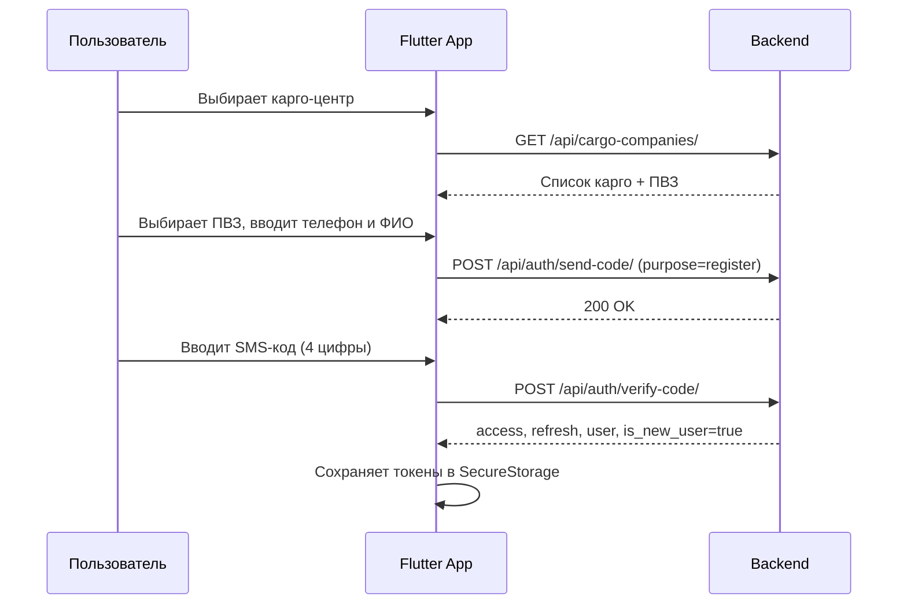
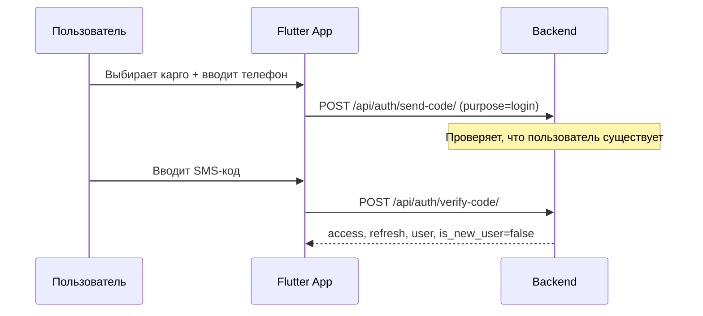

# 315CARGO — документация для Flutter-клиента

Полное руководство по разработке мобильного приложения на Flutter для backend 315CARGO (Django REST Framework + JWT).

---

## Содержание

1. [Обзор](#1-обзор)
2. [Требования и окружение](#2-требования-и-окружение)
3. [Создание проекта](#3-создание-проекта)
4. [Конфигурация API](#4-конфигурация-api)
5. [Архитектура приложения](#5-архитектура-приложения)
6. [Аутентификация (SMS + JWT)](#6-аутентификация-sms--jwt)
7. [HTTP-слой (Dio)](#7-http-слой-dio)
8. [Модели данных (Dart)](#8-модели-данных-dart)
9. [Справочник API](#9-справочник-api)
10. [Экраны и навигация](#10-экраны-и-навигация)
11. [Push-уведомления (FCM)](#11-push-уведомления-fcm)
12. [Работа с магазинами (WebView / clipboard)](#12-работа-с-магазинами-webview--clipboard)
13. [Интеграция Pinduoduo](#13-интеграция-pinduoduo)
14. [Обработка ошибок](#14-обработка-ошибок)
15. [Локализация и форматы](#15-локализация-и-форматы)
16. [Тестирование](#16-тестирование)
17. [Сборка и публикация](#17-сборка-и-публикация)
18. [Чеклист перед релизом](#18-чеклист-перед-релизом)

---

## 1. Обзор

315CARGO — мобильное приложение карго-сервиса для клиентов из Кыргызстана. Backend предоставляет REST API для:

- SMS-регистрации и входа (мультитенантность по карго-центрам)
- Профиля клиента с персональным кодом и QR
- Отслеживания заказов и посылок
- Доставки по городу
- Каталога китайских маркетплейсов
- In-app и push-уведомлений
- Интеграции с Pinduoduo

**Swagger (при `ENABLE_API_DOCS=True`):**

| URL | Описание |
|---|---|
| `/api/docs/` | Swagger UI |
| `/api/redoc/` | ReDoc |
| `/api/schema/` | OpenAPI JSON |

**Базовый URL API:** `https://<your-domain>/api/`

**Часовой пояс сервера:** `Asia/Bishkek`  
**Язык API:** русский (`ru-ru`)

---

## 2. Требования и окружение

| Компонент | Версия |
|---|---|
| Flutter SDK | ≥ 3.16 |
| Dart | ≥ 3.2 |
| Android | minSdk 21+, targetSdk 34+ |
| iOS | 13.0+ |
| Firebase | для push (FCM) |

### Рекомендуемые пакеты

```yaml
dependencies:
  flutter:
    sdk: flutter

  # HTTP
  dio: ^5.4.0
  pretty_dio_logger: ^1.3.1        # только debug

  # Хранение токенов
  flutter_secure_storage: ^9.0.0

  # Состояние (на выбор)
  flutter_riverpod: ^2.5.0
  # или provider / bloc

  # Навигация
  go_router: ^14.0.0

  # JSON
  json_annotation: ^4.9.0
  freezed_annotation: ^2.4.0       # опционально

  # UI
  cached_network_image: ^3.3.0
  qr_flutter: ^4.1.0               # отображение QR локально
  webview_flutter: ^4.7.0
  url_launcher: ^6.2.0

  # Push
  firebase_core: ^3.0.0
  firebase_messaging: ^15.0.0

  # Прочее
  intl: ^0.19.0
  connectivity_plus: ^6.0.0

dev_dependencies:
  build_runner: ^2.4.0
  json_serializable: ^6.8.0
  freezed: ^2.5.0
  flutter_test:
    sdk: flutter
  mocktail: ^1.0.0
```

---

## 3. Создание проекта

```bash
flutter create --org kg.cargo315 cargo315_app
cd cargo315_app
flutter pub get
```

### Flavors / окружения

Создайте три конфигурации:

| Flavor | Base URL | Назначение |
|---|---|---|
| `dev` | `http://10.0.2.2:8000/api/` (Android emulator) | локальная разработка |
| `staging` | `https://staging.315cargo.kg/api/` | тестовый сервер |
| `prod` | `https://api.315cargo.kg/api/` | продакшен |

```dart
// lib/core/config/app_config.dart
enum Environment { dev, staging, prod }

class AppConfig {
  const AppConfig({
    required this.baseUrl,
    required this.environment,
  });

  final String baseUrl;
  final Environment environment;

  static AppConfig of(Environment env) => switch (env) {
        Environment.dev => const AppConfig(
            baseUrl: 'http://10.0.2.2:8000/api/',
            environment: Environment.dev,
          ),
        Environment.staging => const AppConfig(
            baseUrl: 'https://staging.315cargo.kg/api/',
            environment: Environment.staging,
          ),
        Environment.prod => const AppConfig(
            baseUrl: 'https://api.315cargo.kg/api/',
            environment: Environment.prod,
          ),
      };
}
```

> **iOS Simulator / физическое устройство:** замените `10.0.2.2` на IP вашего компьютера в локальной сети.

---

## 4. Конфигурация API

### Заголовки по умолчанию

```dart
final headers = {
  'Content-Type': 'application/json',
  'Accept': 'application/json',
  'Accept-Language': 'ru',
};
```

### Авторизация

Все защищённые endpoint'ы требуют заголовок:

```
Authorization: Bearer <access_token>
```

Публичные endpoint'ы (без токена):

- `GET /api/cargo-companies/`
- `GET /api/pickup-points/?cargo=<id>`
- `POST /api/auth/send-code/`
- `POST /api/auth/verify-code/`
- `POST /api/auth/refresh/`

### JWT-параметры (сервер)

| Параметр | По умолчанию |
|---|---|
| Access token | 60 минут |
| Refresh token | 30 дней |
| Ротация refresh | включена (при refresh выдаётся новая пара) |
| Blacklist | включена (logout инвалидирует refresh) |

### Rate limiting

| Scope | Лимит | Endpoint'ы |
|---|---|---|
| `sms` | 3 запроса/мин | `send-code` |
| `auth` | 10 запросов/мин | `verify-code`, `refresh` |

При превышении: HTTP **429**, тело `{"detail": "..."}`.

### Пагинация

API **не использует пагинацию** — списки возвращаются целиком. На клиенте реализуйте локальную фильтрацию и lazy-loading UI при больших списках.

---

## 5. Архитектура приложения

Рекомендуемая структура каталогов:

```
lib/
├── main.dart
├── app.dart
├── core/
│   ├── config/
│   ├── network/
│   │   ├── api_client.dart
│   │   ├── auth_interceptor.dart
│   │   └── api_exception.dart
│   ├── storage/
│   │   └── token_storage.dart
│   └── utils/
├── features/
│   ├── auth/
│   │   ├── data/
│   │   ├── domain/
│   │   └── presentation/
│   ├── profile/
│   ├── orders/
│   ├── parcels/
│   ├── city_delivery/
│   ├── shops/
│   ├── notifications/
│   └── pinduoduo/
└── shared/
    ├── models/
    ├── widgets/
    └── theme/
```

### Слои

```
Presentation (UI) → Domain (use cases) → Data (repositories → API)
```

---

## 6. Аутентификация (SMS + JWT)

### Мультитенантность

Один номер телефона может быть зарегистрирован в **разных карго-центрах** — это отдельные аккаунты. Поле `cargo_id` обязательно во всех auth-запросах.

### Flow регистрации



### Flow входа



### Шаг 1. Список карго-центров

```
GET /api/cargo-companies/
```

Ответ (массив):

```json
[
  {
    "id": 1,
    "title": "315CARGO Бишкек",
    "slug": "315cargo-bishkek",
    "description": "...",
    "logo": "https://api.example.com/media/cargo_logos/logo.png",
    "phone": "+996...",
    "address": "...",
    "pickup_points": [
      {
        "id": 1,
        "title": "ПВЗ Центральный",
        "address": "...",
        "phone": "+996...",
        "work_schedule": "Пн-Сб 9:00-18:00"
      }
    ]
  }
]
```

### Шаг 2. Отправка SMS

```
POST /api/auth/send-code/
```

Тело:

```json
{
  "phone": "+996700000000",
  "cargo_id": 1,
  "purpose": "register"
}
```

| Поле | Тип | Обязательно | Описание |
|---|---|---|---|
| `phone` | string | да | `+996...`, 10–15 цифр |
| `cargo_id` | int | да | ID карго-центра |
| `purpose` | string | нет | `register` (по умолчанию для новых) или `login` |

**Ответ 200:**

```json
{
  "detail": "SMS code sent"
}
```

При mock-SMS на сервере может быть поле `warning` — покажите его в debug-режиме.

**Ошибки:**

| Код | Причина |
|---|---|
| 400 | Невалидный телефон |
| 400 | `purpose=login`, пользователь не найден в этом карго |
| 429 | Повторная отправка раньше 60 секунд |

### Шаг 3. Проверка кода

```
POST /api/auth/verify-code/
```

**Регистрация:**

```json
{
  "phone": "+996700000000",
  "code": "1234",
  "cargo_id": 1,
  "pickup_point_id": 1,
  "full_name": "Иван Иванов"
}
```

**Вход:**

```json
{
  "phone": "+996700000000",
  "code": "1234",
  "cargo_id": 1
}
```

**Ответ 200:**

```json
{
  "access": "eyJ...",
  "refresh": "eyJ...",
  "is_new_user": true,
  "user": {
    "id": 1,
    "cargo": 1,
    "cargo_title": "315CARGO Бишкек",
    "phone": "+996700000000",
    "full_name": "Иван Иванов",
    "pickup_point": 1,
    "pickup_point_title": "ПВЗ Центральный",
    "client_code": "C1234567",
    "qr_code_image": "https://api.example.com/media/qr_codes/C1234567.png",
    "is_cargo_admin": false,
    "created_at": "2026-01-01T12:00:00+06:00",
    "updated_at": "2026-01-01T12:00:00+06:00"
  }
}
```

> После регистрации сервер автоматически генерирует `client_code` (формат `C` + 7 цифр) и QR-изображение. При первом входе создаётся welcome-уведомление.

### Шаг 4. Обновление токена

```
POST /api/auth/refresh/
```

```json
{ "refresh": "eyJ..." }
```

**Ответ 200:**

```json
{
  "access": "eyJ...",
  "refresh": "eyJ..."
}
```

> **Важно:** при каждом refresh сервер выдаёт **новую пару** access + refresh. Сохраняйте оба.

### Шаг 5. Выход

```
POST /api/auth/logout/
Authorization: Bearer <access>
```

```json
{ "refresh": "eyJ..." }
```

**Ответ:** `204 No Content`

После logout refresh-токен попадает в blacklist.

### Хранение сессии на клиенте

```dart
class TokenStorage {
  static const _accessKey = 'access_token';
  static const _refreshKey = 'refresh_token';
  static const _cargoIdKey = 'cargo_id';

  final FlutterSecureStorage _storage;

  Future<void> saveSession({
    required String access,
    required String refresh,
    required int cargoId,
  }) async {
    await _storage.write(key: _accessKey, value: access);
    await _storage.write(key: _refreshKey, value: refresh);
    await _storage.write(key: _cargoIdKey, value: cargoId.toString());
  }

  Future<void> clear() => _storage.deleteAll();
}
```

---

## 7. HTTP-слой (Dio)

### ApiClient с авто-refresh

```dart
class AuthInterceptor extends QueuedInterceptor {
  AuthInterceptor({
    required this.tokenStorage,
    required this.dio,
    required this.onLogout,
  });

  final TokenStorage tokenStorage;
  final Dio dio;
  final VoidCallback onLogout;

  @override
  void onRequest(RequestOptions options, RequestInterceptorHandler handler) async {
    final access = await tokenStorage.readAccess();
    if (access != null) {
      options.headers['Authorization'] = 'Bearer $access';
    }
    handler.next(options);
  }

  @override
  void onError(DioException err, ErrorInterceptorHandler handler) async {
    if (err.response?.statusCode != 401) {
      return handler.next(err);
    }

    final refresh = await tokenStorage.readRefresh();
    if (refresh == null) {
      onLogout();
      return handler.next(err);
    }

    try {
      final response = await dio.post(
        'auth/refresh/',
        data: {'refresh': refresh},
        options: Options(headers: {}), // без Authorization
      );
      final newAccess = response.data['access'] as String;
      final newRefresh = response.data['refresh'] as String;
      await tokenStorage.saveTokens(access: newAccess, refresh: newRefresh);

      err.requestOptions.headers['Authorization'] = 'Bearer $newAccess';
      final retry = await dio.fetch(err.requestOptions);
      return handler.resolve(retry);
    } catch (_) {
      onLogout();
      return handler.next(err);
    }
  }
}
```

### Пример репозитория

```dart
class AuthRepository {
  AuthRepository(this._client);
  final Dio _client;

  Future<AuthResponse> verifyCode(VerifyCodeRequest request) async {
    final response = await _client.post(
      'auth/verify-code/',
      data: request.toJson(),
    );
    return AuthResponse.fromJson(response.data);
  }
}
```

---

## 8. Модели данных (Dart)

### User

```dart
@JsonSerializable()
class User {
  final int id;
  final int cargo;
  final String cargoTitle;
  final String phone;
  final String fullName;
  final int? pickupPoint;
  final String? pickupPointTitle;
  final String? clientCode;
  final String? qrCodeImage;
  final bool isCargoAdmin;
  final DateTime createdAt;
  final DateTime updatedAt;

  factory User.fromJson(Map<String, dynamic> json) => _$UserFromJson(json);
}
```

### AuthResponse

```dart
@JsonSerializable()
class AuthResponse {
  final String access;
  final String refresh;
  final User user;
  final bool isNewUser;

  factory AuthResponse.fromJson(Map<String, dynamic> json) =>
      _$AuthResponseFromJson(json);
}
```

### Order

```dart
enum OrderSource { pinduoduo, taobao, shop1688, manual }

enum OrderStatus {
  created,
  paid,
  purchased,
  waitingChinaWarehouse,
  arrivedChinaWarehouse,
  cancelled,
}

@JsonSerializable()
class Order {
  final int id;
  final int user;
  final OrderSource source;
  final String sourceDisplayName;
  final String externalOrderId;
  final String productUrl;
  final String productTitle;
  final double? price;
  final int quantity;
  final OrderStatus status;
  final String statusDisplayName;
  final String trackNumber;
  final Map<String, dynamic> rawData;
  final DateTime createdAt;
  final DateTime updatedAt;
}
```

### Parcel

```dart
enum ParcelStatus {
  created,
  purchased,
  waitingChinaWarehouse,
  arrivedChinaWarehouse,
  sentToKyrgyzstan,
  arrivedKyrgyzstan,
  atPickupPoint,
  cityDelivery,
  delivered,
  issued,
  cancelled,
}

@JsonSerializable()
class Parcel {
  final int id;
  final int user;
  final int? order;
  final String trackNumber;
  final String clientCode;
  final ParcelStatus status;
  final String statusDisplayName;
  final String location;
  final double? weight;
  final double? volume;
  final double? deliveryPrice;
  final DateTime? arrivedAt;
  final DateTime? issuedAt;
  final DateTime createdAt;
  final DateTime updatedAt;
}
```

### Notification

```dart
enum NotificationType {
  auth,
  orderCreated,
  orderStatusChanged,
  parcelStatusChanged,
  parcelAtPickupPoint,
  cityDeliveryCreated,
  cityDeliveryStatusChanged,
  pinduoduoConnected,
  pinduoduoSynced,
  system,
}

@JsonSerializable()
class AppNotification {
  final int id;
  final String title;
  final String body;
  final NotificationType type;
  final String typeDisplayName;
  final bool isRead;
  final Map<String, dynamic> data;
  final DateTime createdAt;
}
```

### Enum mapping (JSON → Dart)

Backend отдаёт snake_case строки. Пример маппинга:

```dart
ParcelStatus parseParcelStatus(String value) => switch (value) {
      'created' => ParcelStatus.created,
      'at_pickup_point' => ParcelStatus.atPickupPoint,
      'sent_to_kyrgyzstan' => ParcelStatus.sentToKyrgyzstan,
      // ...
      _ => throw ArgumentError('Unknown status: $value'),
    };
```

---

## 9. Справочник API

### Профиль

| Метод | URL | Auth | Описание |
|---|---|---|---|
| GET | `/api/profile/` | да | Текущий пользователь |
| PATCH | `/api/profile/` | да | Обновить `full_name`, `pickup_point` |
| GET | `/api/profile/qr/` | да | `client_code` + URL QR-изображения |
| GET | `/api/profile/notification-preferences/` | да | Настройки уведомлений |
| PATCH | `/api/profile/notification-preferences/` | да | Обновить настройки |

**PATCH /api/profile/:**

```json
{
  "full_name": "Новое Имя",
  "pickup_point": 2
}
```

**GET /api/profile/qr/:**

```json
{
  "client_code": "C1234567",
  "qr_code_image": "https://api.example.com/media/qr_codes/C1234567.png"
}
```

**Notification preferences:**

```json
{
  "push_enabled": true,
  "parcel_status_enabled": true,
  "order_status_enabled": true,
  "city_delivery_enabled": true,
  "marketing_enabled": false,
  "updated_at": "2026-01-01T12:00:00+06:00"
}
```

---

### Справочники

#### ПВЗ

| Метод | URL | Auth | Описание |
|---|---|---|---|
| GET | `/api/pickup-points/?cargo=<id>` | нет | Список ПВЗ карго-центра |

#### Магазины

| Метод | URL | Auth | Описание |
|---|---|---|---|
| GET | `/api/shops/` | да | Магазины карго пользователя |

**Ответ:**

```json
[
  {
    "id": 1,
    "title": "Pinduoduo",
    "slug": "pinduoduo",
    "icon": "https://api.example.com/media/shop_icons/pdd.png",
    "open_url": "https://mobile.yangkeduo.com/?client_code=C1234567",
    "open_type": "webview",
    "client_code": null,
    "instruction": null
  }
]
```

| `open_type` | Действие в Flutter |
|---|---|
| `webview` | `WebViewWidget` внутри приложения |
| `external_app` | `url_launcher` с `LaunchMode.externalApplication` |
| `browser` | `url_launcher` с `LaunchMode.externalApplication` |

| `client_code_strategy` | Поведение |
|---|---|
| `query_param` | `open_url` уже содержит код в URL |
| `clipboard` | `client_code` = код пользователя, скопировать в буфер |
| `manual_instruction` | показать `instruction` с кодом |

#### Тарифы доставки по городу

| Метод | URL | Auth | Описание |
|---|---|---|---|
| GET | `/api/city-delivery-tariffs/` | да | Активные тарифы для ПВЗ пользователя |

---

### Заказы

| Метод | URL | Auth | Описание |
|---|---|---|---|
| GET | `/api/orders/` | да | Список заказов |
| GET | `/api/orders/{id}/` | да | Детали заказа |
| POST | `/api/orders/manual/` | да | Ручное создание |

**Фильтры (query params):**

| Параметр | Пример | Описание |
|---|---|---|
| `status` | `created` | Статус заказа |
| `source` | `pinduoduo` | Источник |
| `track_number` | `LP123` | Трек-номер (частичное совпадение) |
| `date_from` | `2026-01-01` | Дата создания от |
| `date_to` | `2026-01-31` | Дата создания до |

**POST /api/orders/manual/:**

```json
{
  "product_url": "https://example.com/item",
  "product_title": "Товар",
  "price": "1500.00",
  "quantity": 2,
  "track_number": "LP123456"
}
```

**Статусы заказа:**

| Значение | Отображение |
|---|---|
| `created` | Оформлен |
| `paid` | Оплачен |
| `purchased` | Выкуплен |
| `waiting_china_warehouse` | Ожидается на складе в Китае |
| `arrived_china_warehouse` | Прибыл на склад в Китае |
| `cancelled` | Отменён |

---

### Посылки

| Метод | URL | Auth | Описание |
|---|---|---|---|
| GET | `/api/parcels/` | да | Список посылок |
| GET | `/api/parcels/{id}/` | да | Детали |
| GET | `/api/parcels/{id}/history/` | да | История статусов |

**Фильтры:** `status`, `track_number`, `date_from`, `date_to`

**Статусы посылки (жизненный цикл):**

```
created → purchased → waiting_china_warehouse → arrived_china_warehouse
  → sent_to_kyrgyzstan → arrived_kyrgyzstan → at_pickup_point
  → [city_delivery] → delivered → issued
```

| Значение | Отображение |
|---|---|
| `created` | Оформлен |
| `purchased` | Выкуплен |
| `waiting_china_warehouse` | Ожидается на складе в Китае |
| `arrived_china_warehouse` | Прибыл на склад в Китае |
| `sent_to_kyrgyzstan` | Отправлен в Кыргызстан |
| `arrived_kyrgyzstan` | Прибыл в Кырgyzstan |
| `at_pickup_point` | В ПВЗ |
| `city_delivery` | Передан на доставку по городу |
| `delivered` | Доставлен |
| `issued` | Выдан клиенту |
| `cancelled` | Отменён |

**История статуса:**

```json
[
  {
    "id": 1,
    "status": "at_pickup_point",
    "status_display_name": "В ПВЗ",
    "comment": "",
    "changed_by": null,
    "changed_by_phone": null,
    "created_at": "2026-01-15T10:00:00+06:00"
  }
]
```

---

### Доставка по городу

| Метод | URL | Auth | Описание |
|---|---|---|---|
| POST | `/api/city-delivery/estimate/` | да | Предварительный расчёт |
| POST | `/api/city-delivery/` | да | Создать заявку |
| GET | `/api/city-delivery/` | да | Список заявок |
| GET | `/api/city-delivery/{id}/` | да | Детали заявки |

**POST /api/city-delivery/estimate/:**

```json
{ "parcel": 5 }
```

**Ответ:**

```json
{
  "parcel": 5,
  "weight": "2.500",
  "price": "350.00",
  "tariff": {
    "id": 1,
    "title": "Стандарт",
    "base_price": "200.00",
    "price_per_kg": "50.00",
    "free_weight_kg": "1.000",
    "min_price": "200.00",
    "is_default": true,
    "is_active": true,
    "pickup_point": 1,
    "pickup_point_title": "ПВЗ Центральный"
  }
}
```

**POST /api/city-delivery/:**

```json
{
  "parcel": 5,
  "address": "г. Бишкек, ул. Примерная 1, кв. 5",
  "recipient_name": "Иван Иванов",
  "recipient_phone": "+996700000000",
  "comment": "Позвонить за 30 мин",
  "delivery_date": "2026-01-20",
  "delivery_time_slot": "14:00-18:00"
}
```

Цена и тариф рассчитываются **на сервере** автоматически.

**Статусы заявки:**

| Значение | Отображение |
|---|---|
| `created` | Создана |
| `price_calculated` | Стоимость рассчитана |
| `accepted` | Принята |
| `assigned_to_courier` | Назначен курьер |
| `in_delivery` | В доставке |
| `delivered` | Доставлена |
| `cancelled` | Отменена |

**Ограничения:**

- Заявку можно создать только для **своей** посылки
- Нельзя для посылок со статусом `issued`, `delivered`, `cancelled`

---

### Уведомления

| Метод | URL | Auth | Описание |
|---|---|---|---|
| GET | `/api/notifications/` | да | Список |
| GET | `/api/notifications/unread-count/` | да | `{ "count": 3 }` |
| POST | `/api/notifications/{id}/read/` | да | Отметить прочитанным |
| POST | `/api/notifications/read-all/` | да | `{ "updated": 5 }` |
| POST | `/api/device-tokens/` | да | Регистрация FCM-токена |

**POST /api/device-tokens/:**

```json
{
  "token": "fcm_device_token_here",
  "platform": "android"
}
```

| `platform` | Значение |
|---|---|
| iOS | `"ios"` |
| Android | `"android"` |

> Повторная регистрация того же токена обновляет привязку к текущему пользователю (`update_or_create`).

---

### Pinduoduo

| Метод | URL | Auth | Описание |
|---|---|---|---|
| POST | `/api/integrations/pinduoduo/connect/` | да | Подключить аккаунт |
| POST | `/api/integrations/pinduoduo/disconnect/` | да | Отключить |
| POST | `/api/integrations/pinduoduo/sync/` | да | Синхронизировать заказы |
| GET | `/api/integrations/pinduoduo/status/` | да | Статус подключения |

**POST connect:**

```json
{
  "session_data": {
    "cookies": "...",
    "token": "..."
  }
}
```

**GET status:**

```json
{
  "is_connected": true,
  "external_user_id": "pdd_user_123",
  "last_sync_at": "2026-01-10T15:00:00+06:00",
  "last_sync_error": "",
  "created_at": "2026-01-01T12:00:00+06:00",
  "updated_at": "2026-01-10T15:00:00+06:00"
}
```

**POST sync — ответ:**

```json
{
  "synced": 10,
  "created": 3,
  "updated": 7,
  "message": "OK",
  "errors": []
}
```

> Реализация клиента Pinduoduo на сервере настраивается через `PINDUODUO_CLIENT_PATH`. По умолчанию — no-op. Для WebView-парсинга используйте `session_data` из WebView после авторизации пользователя на Pinduoduo.

---

### 9.X Эндпоинты для владельцев карго (роль `is_cargo_admin`)

Доступны только пользователям с ролью владельца/админа карго (JWT того же пользователя; флаг приходит в `/api/profile/`). Клиентам возвращается `403`.

**Сканер посылок (одно поле — трек-номер):**

```
POST /api/parcels/scan/
{ "track_number": "LP00123456789CN" }     // status опционально
```

Ответ `200/201`:

```json
{ "result": "created_pending", "parcel": { "id": 12, "track_number": "...", "status": "arrived_china_warehouse", "user": null } }
```

`result` ∈ `updated` | `created_from_order` | `created_pending`. Трек из чужого карго → `409 {"code": "conflict"}`.

Привязать pending-посылку к клиенту:

```
POST /api/parcels/{id}/assign/
{ "client_code": "C1234567" }
```

**Панель управления:**

| Метод | URL | Описание |
|---|---|---|
| GET/POST | `/api/manage/pickup-points/` | список/создание своих ПВЗ |
| GET/PATCH/DELETE | `/api/manage/pickup-points/{id}/` | изменение/удаление ПВЗ |
| GET/POST/PATCH/DELETE | `/api/manage/city-delivery-tariffs/` `…/{id}/` | тарифы доставки |
| GET/PATCH | `/api/manage/cargo/` | профиль своего карго (без `slug`/`is_active`) |
| GET | `/api/manage/dashboard/` | статистика своего карго |

### 9.Y Эндпоинт главного владельца (суперпользователь)

```
GET /api/admin/overview/
```

```json
{
  "totals": { "cargo_count": 5, "active_cargo_count": 4, "user_count": 1200, "parcel_count": 8000, "order_count": 9000, "pickup_point_count": 18 },
  "per_cargo": [ { "id": 1, "title": "Карго А", "slug": "cargo-a", "is_active": true, "users_count": 300, "parcels_count": 2000, "orders_count": 2200, "pickup_points_count": 5 } ]
}
```

---

## 10. Экраны и навигация

### Рекомендуемая карта экранов

```
Splash
  └── Onboarding (первый запуск)
        └── Auth
              ├── Выбор карго-центра
              ├── Выбор ПВЗ (регистрация)
              ├── Ввод телефона
              ├── Ввод SMS-кода
              └── (успех) → Main
Main (BottomNavigation)
  ├── Home (дашборд)
  │     ├── Активные посылки
  │     ├── Непрочитанные уведомления
  │     └── Быстрые действия
  ├── Orders
  │     ├── Список заказов (фильтры)
  │     ├── Детали заказа
  │     └── Создание ручного заказа
  ├── Parcels
  │     ├── Список посылок (фильтры)
  │     ├── Детали + timeline истории
  │     └── Заказ доставки по городу
  ├── Shops
  │     ├── Список магазинов
  │     └── WebView / внешний браузер
  └── Profile
        ├── Данные профиля
        ├── QR-код (полноэкранный)
        ├── Настройки уведомлений
        ├── Pinduoduo
        ├── Уведомления (inbox)
        └── Выход
```

### GoRouter — пример

```dart
final router = GoRouter(
  redirect: (context, state) {
    final isLoggedIn = ref.read(authProvider).isAuthenticated;
    final isAuthRoute = state.matchedLocation.startsWith('/auth');
    if (!isLoggedIn && !isAuthRoute) return '/auth/cargo';
    if (isLoggedIn && isAuthRoute) return '/';
    return null;
  },
  routes: [
    GoRoute(path: '/auth/cargo', builder: (_, __) => const CargoSelectScreen()),
    GoRoute(path: '/auth/phone', builder: (_, __) => const PhoneScreen()),
    GoRoute(path: '/auth/code', builder: (_, __) => const OtpScreen()),
    ShellRoute(
      builder: (_, __, child) => MainShell(child: child),
      routes: [
        GoRoute(path: '/', builder: (_, __) => const HomeScreen()),
        GoRoute(path: '/orders', builder: (_, __) => const OrdersScreen()),
        GoRoute(path: '/parcels', builder: (_, __) => const ParcelsScreen()),
        GoRoute(path: '/shops', builder: (_, __) => const ShopsScreen()),
        GoRoute(path: '/profile', builder: (_, __) => const ProfileScreen()),
      ],
    ),
  ],
);
```

### UI-рекомендации по статусам

- Используйте `status_display_name` с сервера — не дублируйте переводы на клиенте
- Timeline посылки: стройте из `/history/`, сортируйте по `created_at` desc
- Цветовая кодировка: зелёный для `at_pickup_point`, синий для «в пути», серый для `cancelled`

---

## 11. Push-уведомления (FCM)

### Настройка Firebase

1. Создайте проект в [Firebase Console](https://console.firebase.google.com/)
2. Добавьте Android (`google-services.json`) и iOS (`GoogleService-Info.plist`)
3. На сервере укажите `FCM_CREDENTIALS_PATH` — путь к service account JSON
4. Без credentials сервер работает в mock-режиме (push не отправляется, in-app уведомления создаются)

### Инициализация в Flutter

```dart
Future<void> setupPushNotifications() async {
  FirebaseMessaging messaging = FirebaseMessaging.instance;

  await messaging.requestPermission(
    alert: true,
    badge: true,
    sound: true,
  );

  final token = await messaging.getToken();
  if (token != null) {
    await deviceTokenRepository.register(
      token: token,
      platform: Platform.isIOS ? 'ios' : 'android',
    );
  }

  FirebaseMessaging.instance.onTokenRefresh.listen((newToken) {
    deviceTokenRepository.register(
      token: newToken,
      platform: Platform.isIOS ? 'ios' : 'android',
    );
  });

  FirebaseMessaging.onMessage.listen(_handleForegroundMessage);
  FirebaseMessaging.onMessageOpenedApp.listen(_handleNotificationTap);
}
```

### Payload push

Сервер отправляет:

- `notification.title` / `notification.body` — для системного баннера
- `data` — строковые key-value (например `type`, `parcel_id`)

Пример обработки tap:

```dart
void _handleNotificationTap(RemoteMessage message) {
  final type = message.data['type'];
  final parcelId = message.data['parcel_id'];

  switch (type) {
    case 'parcel_at_pickup_point':
      router.push('/parcels/$parcelId');
    case 'order_status_changed':
      router.push('/orders/${message.data['order_id']}');
    default:
      router.push('/profile/notifications');
  }
}
```

### Синхронизация badge

При открытии приложения:

```dart
final count = await notificationsRepository.unreadCount();
// обновить badge через flutter_app_badger или локальный state
```

---

## 12. Работа с магазинами (WebView / clipboard)

```dart
Future<void> openShop(Shop shop, BuildContext context) async {
  switch (shop.clientCodeStrategy) {
    case ClientCodeStrategy.queryParam:
      await _openUrl(shop.openUrl, shop.openType);
    case ClientCodeStrategy.clipboard:
      await Clipboard.setData(ClipboardData(text: shop.clientCode!));
      ScaffoldMessenger.of(context).showSnackBar(
        const SnackBar(content: Text('Код скопирован в буфер обмена')),
      );
      await _openUrl(shop.openUrl, shop.openType);
    case ClientCodeStrategy.manualInstruction:
      await showDialog(
        context: context,
        builder: (_) => AlertDialog(
          title: const Text('Инструкция'),
          content: Text(shop.instruction ?? ''),
        ),
      );
      await _openUrl(shop.openUrl, shop.openType);
  }
}

Future<void> _openUrl(String url, OpenType type) async {
  switch (type) {
    case OpenType.webview:
      // Navigator.push → ShopWebViewScreen(url: url)
      break;
    case OpenType.externalApp:
    case OpenType.browser:
      await launchUrl(Uri.parse(url), mode: LaunchMode.externalApplication);
  }
}
```

---

## 13. Интеграция Pinduoduo

### Архитектура (важно — проверено экспериментально)

У Pinduoduo **нет публичного API для покупателя**, а запросы защищены анти-ботом
(`anti-content`/`c-kf`/`verifyauthtoken` + проверка TLS-отпечатка). Серверный
парсинг невозможен: бэкенд не может сгенерировать валидную подпись. **Поэтому
парсинг идёт внутри WebView** — страница PDD сама подписывает свои запросы, а мы
лишь **перехватываем ответ** `order_list_v4` и отправляем его на бэкенд. Ничего
ломать/подделывать не нужно.

```
WebView (реальное устройство, юзер залогинен 1 раз)
  → грузит orders.html (можно скрыто/фоном при старте приложения)
  → JS-hook перехватывает ОТВЕТ order_list_v4 (подпись валидна — её делает PDD)
  → Flutter мапит заказы → POST /api/integrations/pinduoduo/ingest/
бэкенд: маппинг → дедуп → авто-создание Parcel по трек-номеру
```

**Ограничения** (озвучить продукту): синк идёт, когда приложение открыто (или
через background-fetch); сессия PDD протухает → при редиректе на логин шлём
`POST /session-expired/` и просим клиента войти заново.

### Рекомендуемый UX

1. Экран «Подключить Pinduoduo» → кнопка открывает WebView с логином.
2. Клиент входит сам (телефон + SMS — PDD обрабатывает капчу/анти-бот).
3. После входа → `POST .../connect/` (просто помечаем подключённым).
4. Дальше при запуске приложения — скрытый WebView грузит заказы и шлёт на `/ingest`.

### Зависимость

Для перехвата сетевых ответов и инъекции скрипта на старте документа используйте
**`flutter_inappwebview`** (у `webview_flutter` нет надёжного перехвата ответов):

```yaml
dependencies:
  flutter_inappwebview: ^6.1.5
```

### Перехват заказов из WebView

```dart
import 'dart:convert';
import 'package:flutter_inappwebview/flutter_inappwebview.dart';

// JS-хук: оборачивает fetch и XHR, ловит ответ order_list_v4 и отдаёт его в Flutter.
const _hookJs = r"""
(function () {
  var TARGET = 'order_list_v4';
  function send(body) {
    try { window.flutter_inappwebview.callHandler('pddOrders', body); } catch (e) {}
  }
  var of = window.fetch;
  window.fetch = function () {
    var args = arguments;
    return of.apply(this, args).then(function (resp) {
      try {
        var u = (args[0] && args[0].url) || args[0];
        if (typeof u === 'string' && u.indexOf(TARGET) > -1) resp.clone().text().then(send);
      } catch (e) {}
      return resp;
    });
  };
  var oOpen = XMLHttpRequest.prototype.open;
  var oSend = XMLHttpRequest.prototype.send;
  XMLHttpRequest.prototype.open = function (m, u) { this.__u = u; return oOpen.apply(this, arguments); };
  XMLHttpRequest.prototype.send = function () {
    var self = this;
    this.addEventListener('load', function () {
      try { if (self.__u && self.__u.indexOf(TARGET) > -1) send(self.responseText); } catch (e) {}
    });
    return oSend.apply(this, arguments);
  };
})();
""";

class PinduoduoSyncWebView extends StatefulWidget {
  const PinduoduoSyncWebView({super.key});
  @override
  State<PinduoduoSyncWebView> createState() => _PinduoduoSyncWebViewState();
}

class _PinduoduoSyncWebViewState extends State<PinduoduoSyncWebView> {
  @override
  Widget build(BuildContext context) {
    return InAppWebView(
      initialUrlRequest: URLRequest(url: WebUri('https://mobile.pinduoduo.com/orders.html')),
      // Инъекция ДО загрузки страницы, чтобы наш хук обернул fetch раньше кода PDD.
      initialUserScripts: UnmodifiableListView([
        UserScript(source: _hookJs, injectionTime: UserScriptInjectionTime.AT_DOCUMENT_START),
      ]),
      onWebViewCreated: (controller) {
        controller.addJavaScriptHandler(
          handlerName: 'pddOrders',
          callback: (args) => _onOrdersJson(args.isNotEmpty ? args.first as String : ''),
        );
      },
      onLoadStop: (controller, url) {
        final u = url?.toString() ?? '';
        // Редирект на логин/проверку → сессия протухла.
        if (u.contains('login.html') || u.contains('psnl_verification')) {
          pinduoduoRepository.markSessionExpired(); // POST /session-expired/
        }
      },
    );
  }

  void _onOrdersJson(String raw) {
    if (raw.isEmpty) return;
    final data = jsonDecode(raw) as Map<String, dynamic>;
    final pdoList = (data['orders'] as List?) ?? const [];
    final orders = pdoList.map(_mapPddOrder).whereType<Map<String, dynamic>>().toList();
    if (orders.isNotEmpty) {
      pinduoduoRepository.ingest(orders); // POST /ingest/ {"orders":[...]}
    }
  }

  // ⚠️ Имена полей PDD сверьте с реальным ответом order_list_v4 в DevTools.
  // Контракт бэкенда стабилен: external_order_id (обяз.), product_title, price,
  // quantity, status, track_number.
  Map<String, dynamic>? _mapPddOrder(dynamic o) {
    if (o is! Map) return null;
    final sn = (o['order_sn'] ?? o['order_id'] ?? '').toString();
    if (sn.isEmpty) return null;
    final goods = (o['order_goods'] ?? o['goods'] ?? o['goods_list']) as List?;
    final firstGoods = (goods != null && goods.isNotEmpty) ? goods.first as Map : const {};
    return {
      'external_order_id': sn,
      'product_title': (firstGoods['goods_name'] ?? '').toString(),
      'price': (o['order_amount'] ?? o['total_amount'])?.toString(),
      'status': (o['order_status'] ?? o['order_status_prompt'] ?? '').toString(),
      'track_number': (o['tracking_number'] ?? o['mail_no'] ?? '').toString(),
      'raw': o,
    };
  }
}
```

Репозиторий-методы — три простых POST на готовые эндпоинты:
`connect()` → `/connect/`, `ingest(orders)` → `/ingest/` с телом `{"orders": [...]}`,
`markSessionExpired()` → `/session-expired/`.

> Сервер сам маппит/дедуплицирует заказы и создаёт `Parcel` по трек-номеру —
> приложению достаточно переслать массив заказов из перехваченного ответа.

---

## 14. Обработка ошибок

### Формат ошибок DRF

**Validation error (400):**

```json
{
  "phone": ["Пользователь не найден в этом карго-центре. Зарегистрируйтесь."],
  "pickup_point_id": ["ПВЗ не принадлежит выбранному карго-центру."]
}
```

**Detail error:**

```json
{ "detail": "Invalid or expired SMS code" }
```

**Throttled (429):**

```json
{ "detail": "SMS code was sent recently" }
```

**Unauthorized (401):**

```json
{ "detail": "Given token not valid for any token type" }
```

### ApiException на клиенте

```dart
class ApiException implements Exception {
  ApiException({
    required this.statusCode,
    this.detail,
    this.fieldErrors = const {},
  });

  final int statusCode;
  final String? detail;
  final Map<String, List<String>> fieldErrors;

  String get userMessage {
    if (detail != null) return detail!;
    if (fieldErrors.isNotEmpty) {
      return fieldErrors.values.first.first;
    }
    return 'Произошла ошибка ($statusCode)';
  }

  factory ApiException.fromDio(DioException e) {
    final data = e.response?.data;
    if (data is Map<String, dynamic>) {
      final fieldErrors = <String, List<String>>{};
      String? detail;
      data.forEach((key, value) {
        if (key == 'detail') {
          detail = value.toString();
        } else if (value is List) {
          fieldErrors[key] = value.map((e) => e.toString()).toList();
        }
      });
      return ApiException(
        statusCode: e.response?.statusCode ?? 0,
        detail: detail,
        fieldErrors: fieldErrors,
      );
    }
    return ApiException(statusCode: e.response?.statusCode ?? 0);
  }
}
```

### Маппинг ошибок для UI

| HTTP | Действие в UI |
|---|---|
| 400 | Показать текст ошибки под полем или SnackBar |
| 401 | Попытка refresh → logout |
| 403 | «Нет доступа» |
| 404 | «Не найдено» |
| 429 | «Подождите минуту перед повторной отправкой» + таймер 60 сек |
| 500+ | «Сервер временно недоступен» + retry |

---

## 15. Локализация и форматы

| Параметр | Значение |
|---|---|
| Язык UI | русский (основной), кыргызский (будущее) |
| Часовой пояс | `Asia/Bishkek` (UTC+6) |
| Формат даты | `dd.MM.yyyy` |
| Формат даты-времени | `dd.MM.yyyy HH:mm` |
| Телефон | `+996 XXX XXX XXX` |
| Валюта | сом (KGS), без символа в API — числовые строки |

```dart
final dateFormat = DateFormat('dd.MM.yyyy HH:mm', 'ru');
final parsed = DateTime.parse(iso8601).toLocal();
```

---

## 16. Тестирование

### Unit-тесты

```dart
test('AuthResponse parses correctly', () {
  final json = {
    'access': 'a',
    'refresh': 'r',
    'is_new_user': true,
    'user': { /* ... */ },
  };
  final response = AuthResponse.fromJson(json);
  expect(response.isNewUser, isTrue);
});
```

### Widget-тесты

- OTP-экран: 4 цифры, кнопка активна только при заполнении
- Список посылок: empty state, loading, error

### Integration-тесты

```dart
testWidgets('login flow', (tester) async {
  await tester.pumpWidget(const App(config: AppConfig.dev));
  // выбор карго → телефон → OTP → главный экран
});
```

### Mock API

Используйте `mocktail` + `DioAdapter` или локальный backend с `SMS_BACKEND=mock` (код в логах сервера).

---

## 17. Сборка и публикация

### Android

```bash
flutter build appbundle --flavor prod -t lib/main_prod.dart
```

`AndroidManifest.xml`:

```xml
<uses-permission android:name="android.permission.INTERNET"/>
<uses-permission android:name="android.permission.POST_NOTIFICATIONS"/>
```

Network security (dev):

```xml
<!-- android/app/src/debug/res/xml/network_security_config.xml -->
<network-security-config>
  <domain-config cleartextTrafficPermitted="true">
    <domain includeSubdomains="true">10.0.2.2</domain>
  </domain-config>
</network-security-config>
```

### iOS

```bash
flutter build ipa --flavor prod -t lib/main_prod.dart
```

`Info.plist`:

```xml
<key>NSAppTransportSecurity</key>
<dict>
  <key>NSAllowsArbitraryLoads</key>
  <false/>
</dict>
```

Push capabilities: Background Modes → Remote notifications.

---

## 18. Чеклист перед релизом

### Auth
- [ ] Регистрация с выбором карго и ПВЗ
- [ ] Вход существующего пользователя (`purpose=login`)
- [ ] Авто-refresh токена при 401
- [ ] Logout с blacklist refresh
- [ ] Обработка 429 на send-code (таймер 60 сек)

### Профиль
- [ ] Отображение client_code и QR
- [ ] Смена ФИО и ПВЗ
- [ ] Настройки уведомлений

### Данные
- [ ] Списки заказов и посылок с фильтрами
- [ ] Timeline истории посылки
- [ ] Ручное создание заказа
- [ ] Доставка по городу: estimate → create

### Магазины
- [ ] WebView / external browser по `open_type`
- [ ] Clipboard strategy
- [ ] Manual instruction

### Push
- [ ] Регистрация FCM-токена после login
- [ ] Re-register при `onTokenRefresh`
- [ ] Deep links из push
- [ ] Badge unread count

### Качество
- [ ] Обработка offline (connectivity_plus)
- [ ] Loading / error / empty states на всех экранах
- [ ] Secure storage для токенов
- [ ] Нет hardcoded API URL в prod-сборке
- [ ] ProGuard/R8 rules для release Android

---

## Приложение A. Быстрый старт для разработчика

```bash
# 1. Запустите backend
cd 315CARGO
python manage.py migrate
python manage.py seed_demo
python manage.py runserver

# 2. Создайте Flutter-проект (см. раздел 3)
# 3. Укажите baseUrl = http://10.0.2.2:8000/api/
# 4. Swagger: http://127.0.0.1:8000/api/docs/

# 5. Тестовый flow:
#    GET  /api/cargo-companies/
#    POST /api/auth/send-code/  { phone, cargo_id, purpose: "register" }
#    POST /api/auth/verify-code/ { phone, code, cargo_id, pickup_point_id, full_name }
#    GET  /api/profile/  (Authorization: Bearer ...)
```

## Приложение B. OpenAPI → Dart models

Автогенерация моделей из схемы:

```bash
# Скачать схему
curl http://127.0.0.1:8000/api/schema/ -o openapi.json

# Сгенерировать клиент (openapi-generator)
openapi-generator generate \
  -i openapi.json \
  -g dart-dio \
  -o lib/generated
```

---

*Документ соответствует backend 315CARGO v1.0.0. При изменении API сверяйтесь со Swagger `/api/docs/`.*
